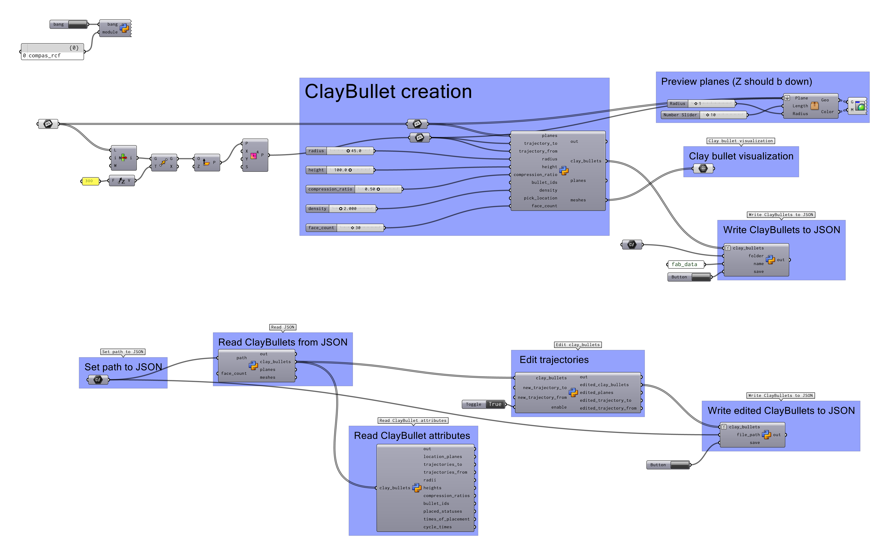
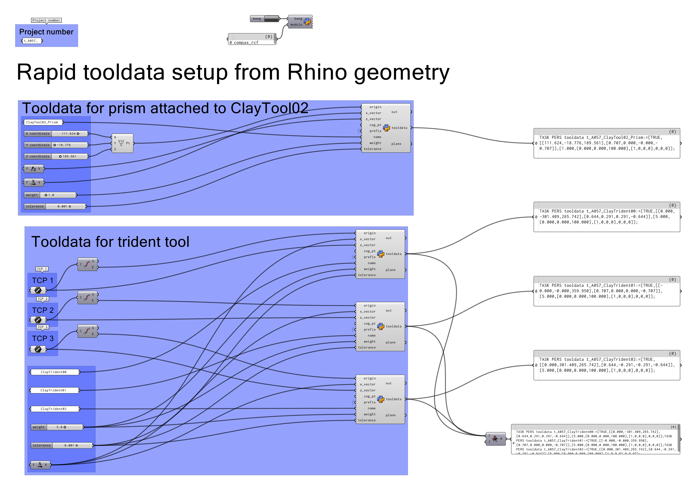
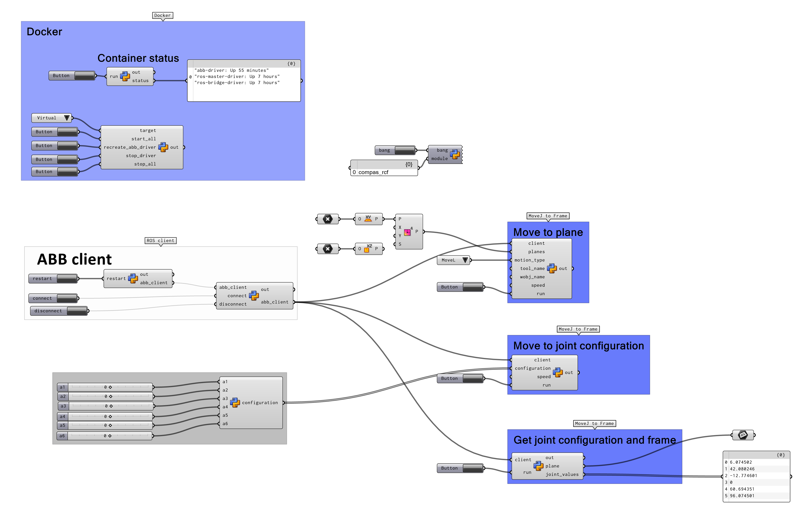

*******************************************************************************
Grasshopper files
*******************************************************************************

.. note::
   Requires ``rapid_clay_formations_fab`` installed and available from inside Rhino. Follow the
   installation steps in :doc:`../installation`.

ClayBullet object creator and JSON read, write and edit
=======================================================

   :download:`create_edit_fab_data.ghx <./../../grasshopper/create_edit_fab_data.ghx>`.

Create Rapid tooldata from Rhino Geometry
=========================================

   :download:`create_rapid_tooldata.ghx <./../../grasshopper/create_rapid_tooldata.ghx>`.

Send commands to ABB controller
===============================

.. note::
   Requires Docker Desktop and ``abb-driver`` docker image from ``compas_rrc``.

   :download:`abb_robot_control.ghx <./../../grasshopper/abb_robot_control.ghx>`.

Localization
============

:download:`localization.ghx <./../../grasshopper/localization.ghx>`.

Path planning
=============

:download:`path_planning.ghx <./../../grasshopper/path_planning.ghx>`.

Pick conf creator
=================

:download:`localization.ghx <./../../grasshopper/localization.ghx>`.
